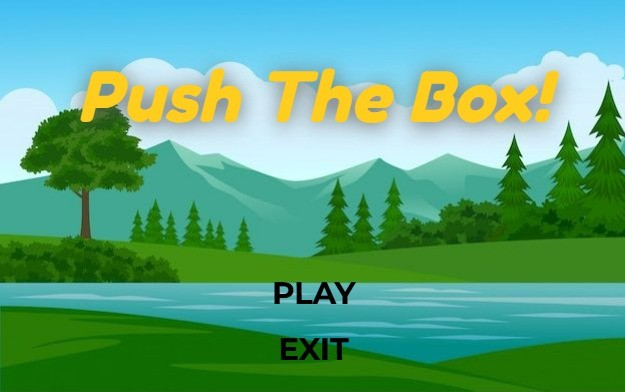

<div>

#  Push-The-Box

</div>

<div align="center">
    <h3> Menu screen </h3>
   
</div>
<hr/>

<div align="center">
    <h3> Push the blocks, reach the key, claim your win!</h3>
   
</div>
<hr/>

<div align="center">
    <h3> Think you're skilled enough to dodge traps and escape this fate?</h3>
   
</div>

<div >

##  Game Idea

</div>

You land in a strange world made of floating islands. Your goal is to push boxes to build paths, watch out for sneaky traps, and keep moving forward. If you’re smart and quick, you’ll reach the key and win the game!

<div >

##  Technology Used

</div>


### 🎮 Game Engine & Architecture

- Built from scratch using **C++17** and **OpenGL**.
- Modular **Entity-Component-System (ECS)** architecture.
- Scene data defined in **JSON files**, no hardcoded objects.

### 🎨 Rendering & Shaders

- Forward rendering pipeline with:
  - **Depth testing**
  - **Face culling**
  - **Blending**
  - **Color/depth masks**
- GLSL shaders for:
  - Color mixing
  - Checkerboard patterns
  - Texture mapping
  - Lighting and post-processing

### 💡 Lighting System

- Support for **multiple lights** with different types and parameters.
- Implemented lighting model with:
  - Albedo
  - Specular
  - Roughness
  - Emission

### 🌌 Sky & Post-processing

- Sky sphere rendering for immersive environments.
- **Framebuffer rendering** with post-processing effects:
  - Vignette
  - Chromatic aberration

### 🧱 Mesh & Materials

- Mesh rendering using:
  - Vertex Buffer Objects (VBOs)
  - Element Buffer Objects (EBOs)
  - Vertex Array Objects (VAOs)
- Material system combining:
  - Shader programs
  - Pipeline state
  - Textures & samplers

### 🧪 Testing & Configurations

- Modular test states: `shader-test`, `mesh-test`, `texture-test`, etc.
- JSON-based configuration files in `/config`.
- Batch testing using `scripts/run-all.ps1` and result comparison via `compare-all.ps1`.

<div >

##  Build and Run

</div>

- Make sure you have `cmake`,`c++ compiler ` and `cmake-tools` for vscode extenstion
- If you're using linux like me, don't worry, it's made `cross-platform`

1. From vscode, `F7` or choose `build` in the below bar
2. Run the following command
   ```bash
       ./bin/GAME_APPLICATION
   ```

## Contributors

<table  >
  <tr>
      <td align="center"><a href="https://github.com/jpassica"><br /><sub><b>jpassica </b></sub></a><br /></td>
     <td align="center"><a href="https://github.com/nourabouzeid"><br /><sub><b>nourabouzeid </b></sub></a><br /></td>
     <td align="center"><a href="https://github.com/AbdelruhmanSamy"><br /><sub><b>Abdelruhman Samy </b></sub></a><br /></td>
     <td align="center"><a href="https://github.com/Mariam-Amin12"><br /><sub><b>Mariam Amin </b></sub></a><br /></td>

  </tr>
</table>
